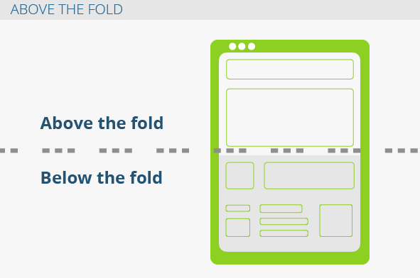

# Optimización de carga de sitios web con WPO (Web Performance Optimization)

## Conociendo Google PageSpeed Insights

Google dentro de sus herramientas para desarrolladores tiene una página que nos inidicara el nivel de rendimiento de una pagina web, tanto en su version móvil como en la pc, y nos dará recomendaciones para optimizar nuestra página:

<https://developers.google.com/speed/pagespeed/insights/>

## Eliminando bloqueos de renderizado

Google recomienda poner nuestras hojas de estilo debajo del **above the fold**, la expresión define la parte del sitio que los usuarios ven primero sin necesidad de desplazarse con el ratón.



## Comprimiendo nuestro archivo CSS

Esto se puede hacer de muchas maneras, ya sea utilizando preprocesadores como Sass, Less o Stylus, o también puedes utilizar Webpack, o bien mediante sitios en internet como <https://csscompressor.com/>

Una vez minificado deberemos crear un nuevo archivo CSS pero que termine en `min.css` para diferenciar de la version sin minificar. Una vez hecho esto debemos apuntar nuestro HTML a este archivo minificado.

```html
<link rel="stylesheet" href="css/style.min.css">
```